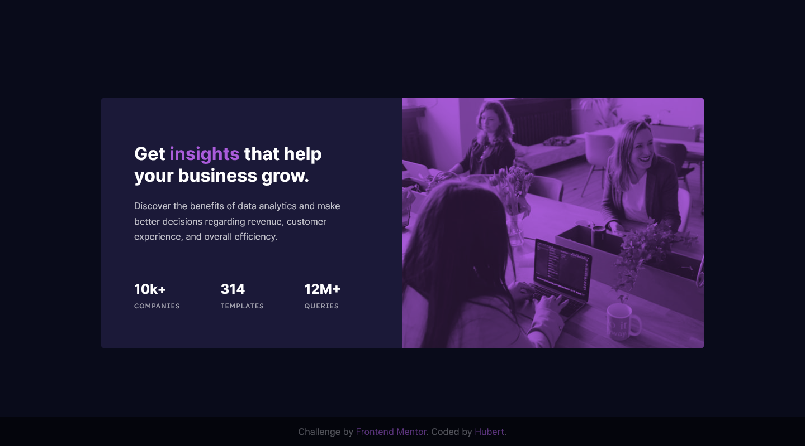

# Frontend Mentor - Stats preview card component solution

This is a solution to the [Stats preview card component challenge on Frontend Mentor](https://www.frontendmentor.io/challenges/stats-preview-card-component-8JqbgoU62). Frontend Mentor challenges help you improve your coding skills by building realistic projects.

## Table of contents

- [Overview](#overview)
  - [The challenge](#the-challenge)
  - [Screenshot](#screenshot)
  - [Links](#links)
- [My process](#my-process)
  - [Built with](#built-with)
  - [What I learned](#what-i-learned)
  - [Continued development](#continued-development)
- [Author](#author)

## Overview

### The challenge

Users should be able to:

- View the optimal layout depending on their device's screen size

### Screenshot



### Links

- Solution URL: [https://github.com/HubertSzymanski5/frontend-mentor-stats-preview-card-component](https://github.com/HubertSzymanski5/frontend-mentor-stats-preview-card-component)
- Live Site URL: [https://frontend-mentor-stats-preview-card-component-yiro.vercel.app/](https://frontend-mentor-stats-preview-card-component-yiro.vercel.app/)

## My process

### Built with

- Semantic HTML5 markup
- CSS custom properties
- Flexbox
- A lot of googling :)

### What I learned

I've started using CSS variables to define main theme and basically
everything else. Althoug I still need to get better at naming as
those feel just too long :)

```css
:root {
	--color-primary-main-bg: hsl(233, 47%, 7%);
	--color-primary-card-bg: hsl(244, 38%, 16%);
	--color-primary-accent: hsl(277, 64%, 61%);

	--color-neutral-main-heading: hsl(0, 0%, 100%);
	--color-neutral-main-paragraph: hsla(0, 0%, 100%, 0.75);
	--color-neutral-stat-heading: hsla(0, 0%, 100%, 0.6);

	--font-main-paragraph: "Inter", sans-serif;
	--font-main-stats: "Lexend Deca", sans-serif;
}
```

Another learning is `@media`. However it was more like eye-opening
that there are a lot of possibilities with this CSS selector. I was
always curious how is it possible to do without use of libs like
`Bootstrap`. This simple CSS is way to go (with much more to come)

```css
@media(max-width: 1200px) {
	.numbers {
		flex-direction: column;
		align-items: center;
	}
}
```

### Continued development

CSS structure and reusability, as in this project I was not thinking
about it at all. Another area for improvement is deeper understanding
of CSS in general.

## Author

- Frontend Mentor - [@HubertSzymanski5](https://www.frontendmentor.io/profile/HubertSzymanski5)
